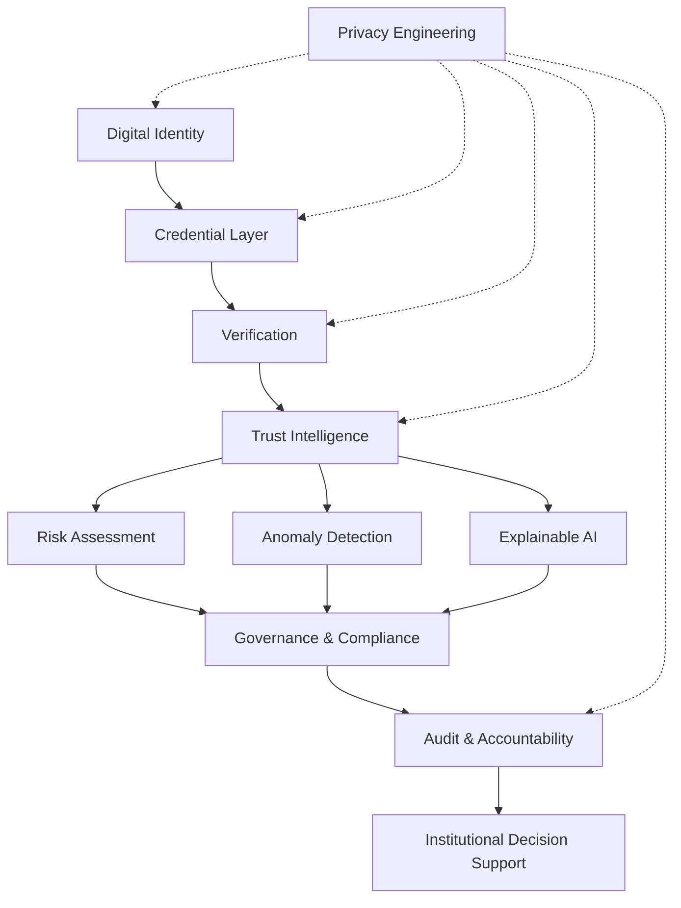

# BATI — Barbados AI Trust Infrastructure

### From Identity to Accountability

**A Privacy-Preserving Digital Infrastructure for AI-Assisted Trust, Compliance, and Governance**.

**A Barbados Artificial Intelligence Research Framework**

> **Research Prototype | Digital Identity | AI | Trust Infrastructure | Governance | Privacy Engineering**

---

## Overview

**BATI (Barbados AI Trust Infrastructure)** is a research-driven digital infrastructure prototype exploring how **digital identity, verifiable credentials, AI-assisted risk intelligence, explainability, and tamper-evident accountability mechanisms** can work together to strengthen trust in digital governance.

The project investigates a practical pathway from **identity → credentials → verification → risk intelligence → accountability**, while maintaining privacy, transparency, and responsible AI principles.

BATI is being developed as a research and technology prototype with relevance to **Barbados, the Caribbean, Africa, and other emerging digital-governance environments**.

---

## The Problem

Digital transformation creates new opportunities for governments, institutions, businesses, and citizens, but also introduces challenges around:

* Identity verification and trust
* Credential authenticity
* Fraud and anomalous behaviour
* Fragmented accountability records
* Explainability of AI-assisted decisions
* Privacy and responsible data use
* Governance and compliance

Many digital systems address these challenges separately.

**BATI explores an integrated trust infrastructure in which identity, credentials, AI-assisted risk analysis, and accountability are connected within a privacy-conscious architecture.**

---

## Research Vision

BATI investigates the following proposition:

> **Can a privacy-preserving digital trust infrastructure connect identity, credentials, AI-assisted risk intelligence, and accountable governance into a coherent system that institutions can evaluate, audit, and potentially scale?**

The research is particularly concerned with the relationship between **technological trust and institutional accountability**.

---

## Research Objectives

1. Develop a digital identity and credential management foundation.
2. Explore AI-assisted risk and anomaly detection.
3. Provide explainable intelligence rather than opaque risk scores.
4. Establish structured audit and accountability mechanisms.
5. Investigate privacy-preserving approaches to digital trust.
6. Develop an architecture suitable for future institutional and cross-sector research.
7. Evaluate the feasibility of applying the model within emerging digital-governance environments.

---

## BATI Architecture



### Architectural Principle

BATI is designed around a layered trust model:

**Identity → Credential → Verification → Intelligence → Governance → Accountability**

Privacy engineering is treated as a cross-cutting concern rather than an isolated feature.

---

## Core Components

### 1. Digital Identity

Provides the foundation for representing individuals and institutional actors within the research environment.

### 2. Credential Infrastructure

Supports credential creation, verification, expiration, and revocation.

### 3. Verification

Provides mechanisms for determining whether credentials remain valid and trustworthy.

### 4. Risk Intelligence

Explores structured risk assessment using risk events, classifications, scores, and explanations.

### 5. Anomaly Detection

Provides a research pathway for identifying potentially unusual or suspicious patterns requiring further investigation.

### 6. Explainable AI

Explores how AI-assisted assessments can provide interpretable reasoning rather than simply producing opaque decisions.

### 7. Audit & Accountability

Maintains structured audit records connecting actions, entities, actors, timestamps, and outcomes.

### 8. Governance & Compliance

Provides a framework for connecting technical events with institutional accountability and compliance processes.

---

## Research Methodology

BATI follows an iterative **research-and-prototype methodology**:


The prototype is intended to support experimentation, evaluation, and future empirical research rather than claim that all proposed capabilities are production-ready.

---

## Current Implementation

The current prototype includes:

* FastAPI backend
* SQLAlchemy data layer
* Digital identity management
* Credential management
* Credential verification and revocation
* Risk-event infrastructure
* Risk assessment services
* Audit logging
* Search infrastructure
* Research model registry
* React/Vite research interface
* Governance and accountability views
* Risk and intelligence dashboards

### Technology Stack

| Layer             | Technology                                        |
| ----------------- | ------------------------------------------------- |
| Frontend          | React, TypeScript, Vite                           |
| Backend           | Python, FastAPI                                   |
| Database          | SQLAlchemy-compatible relational database         |
| API               | REST                                              |
| AI / Intelligence | Research-oriented AI and risk-analysis components |
| Visualization     | React-based dashboards and charts                 |
| Development       | Git, VS Code, Postman                             |

---

## Expected Impact

BATI is intended to contribute to research and future innovation in:

* **Digital identity and trust**
* **Privacy-preserving technology**
* **Responsible AI**
* **AI-assisted risk management**
* **Digital governance**
* **Institutional accountability**
* **Compliance infrastructure**
* **Public-sector digital transformation**

Potential beneficiaries include:

* Government and public institutions
* Regulatory and compliance bodies
* Educational institutions
* Businesses and professional organizations
* Researchers and technology innovators
* Citizens interacting with digital public services

---

## Africa–Caribbean Relevance

BATI provides a potential platform for **Africa–Caribbean knowledge exchange** around digital trust, responsible AI, privacy engineering, and institutional accountability.

The research explores how emerging digital infrastructure can be designed with consideration for:

* Developing digital economies
* Public-sector modernization
* Institutional trust
* Cross-border collaboration
* Responsible adoption of AI
* Privacy and data governance

The Barbados context provides an important Caribbean research environment, while the broader framework is intended to be adaptable to other emerging digital-governance contexts.

---

## Future Research

Future phases may investigate:

* Decentralized Identifiers (DIDs)
* Verifiable Credentials
* Zero-Knowledge Proofs
* Privacy-preserving identity verification
* Federated and privacy-preserving AI
* Advanced anomaly detection
* AI model evaluation and benchmarking
* Algorithmic accountability
* Institutional interoperability
* Blockchain or distributed-ledger integration where justified
* Real-world pilot studies and stakeholder evaluation

These capabilities represent **future research directions and are not claimed as fully implemented in the current prototype**.

---

## Research & Collaboration Opportunities

BATI is positioned as an **open research and technology prototype** that can support collaboration with:

* Universities and research institutions
* Government agencies
* Digital-governance organizations
* AI and technology researchers
* Privacy and cybersecurity specialists
* Caribbean and African institutions
* Development and innovation organizations
* Potential research and grant partners

Potential collaboration areas include **research validation, pilot deployment, data governance, AI evaluation, privacy engineering, institutional use cases, and cross-regional digital-governance research**.

---

## Privacy, Security & Responsible AI

Privacy and responsible technology are central research considerations.

BATI is designed to investigate:

* Data minimization
* Controlled access
* Auditability
* Explainability
* Responsible AI practices
* Separation of identity and intelligence functions
* Future privacy-preserving verification mechanisms

The prototype should **not be interpreted as a production security system or as a replacement for institutional legal, regulatory, cybersecurity, or compliance controls.**

---

## Research Prototype Disclaimer

BATI is a **research and experimental prototype**.

The current implementation demonstrates architectural concepts and selected working components. It is not yet presented as a production-ready identity, financial, governmental, or compliance platform.

Claims regarding advanced privacy technologies, decentralized identity, zero-knowledge proofs, federated learning, or large-scale institutional deployment represent areas for **future research, validation, and experimentation**.

---

## Project Structure

```text
BATI/
├── backend/
│   ├── app/
│   │   ├── api/
│   │   ├── core/
│   │   ├── models/
│   │   ├── schemas/
│   │   └── services/
│   └── requirements.txt
│
├── frontend/
│   ├── src/
│   │   ├── components/
│   │   ├── pages/
│   │   ├── routes/
│   │   └── services/
│   ├── package.json
│   └── vite.config.ts
│
├── .gitignore
└── README.md
```

---

## Running the Prototype

### Backend

```bash
cd backend

# Activate the virtual environment
# Windows PowerShell:
.\.venv\Scripts\Activate.ps1

pip install -r requirements.txt

python -m uvicorn app.main:app --reload
```

Backend:

```text
http://127.0.0.1:8000
```

API documentation:

```text
http://127.0.0.1:8000/docs
```

### Frontend

```bash
cd frontend

npm install
npm run dev
```

Frontend:

```text
http://localhost:5173
```

---

## API

The prototype currently exposes research-oriented API areas including:

```text
/api/dashboard
/api/identities
/api/credentials
/api/audit
/api/risk
/api/search
/api/research/models
```

Interactive API documentation is available through FastAPI Swagger UI at:

```text
/docs
```

---

## Project Status

**Current Status: Active Research Prototype**

BATI currently demonstrates a functional foundation connecting:

**Identity + Credentials + Verification + Risk Intelligence + Audit + Governance**

The project is being developed incrementally toward deeper validation, privacy-preserving mechanisms, AI evaluation, and potential institutional research partnerships.

---

## Research Context

**Research Theme**

> **FROM IDENTITY TO ACCOUNTABILITY**

**Research Focus**

Privacy-Preserving Digital Infrastructure for AI-Assisted Trust, Compliance, and Governance.
A Barbados Artificial Intelligence Research Framework

**Key Research Areas**

`Digital Identity` · `Privacy Engineering` · `Artificial Intelligence` · `Trust Infrastructure` · `Governance` · `Compliance` · `Responsible AI` · `Risk Management` · `Accountability`

---

## Author
## Author

**Ibe Ezenwa Augustine**

**Full-Stack Software Engineer | Maritime Operations & Logistics | Researcher | New York Center for Advanced Research (NYCAR)**

**Research Period: September-December 2026**

BATI is developed as part of an ongoing postgraduate research and prototype-development programme at the **New York Center for Advanced Research (NYCAR)**, exploring the intersection of software engineering, artificial intelligence, digital identity, privacy, trust, compliance, and governance.

The research forms part of the requirements for the **Artificial Intelligence Research Residency in Barbados**, with the resulting research and prototype contributing to a publication focused on privacy-preserving digital infrastructure for AI-assisted trust, compliance, and governance.

---

## Collaboration

BATI welcomes **research, technical, institutional, academic, and development-oriented collaboration** with organizations and individuals interested in trustworthy digital infrastructure.

**Areas of interest:** Digital Identity · Responsible AI · Privacy Engineering · Digital Governance · Trust Infrastructure · Risk Intelligence · Institutional Accountability · Africa–Caribbean Knowledge Exchange · AI Research & Innovation

**Research Context:** Artificial Intelligence Research Residency in Barbados · New York Center for Advanced Research (NYCAR) · September 2026

---

## License

This project is intended for research, educational, and experimental purposes. Licensing terms may be updated as the project evolves.

---

### Final Proposition

> **BATI explores how digital identity can become the foundation for trustworthy credentials, explainable AI-assisted intelligence, privacy-conscious governance, and institutional accountability — moving digital systems from identity toward accountability.**
